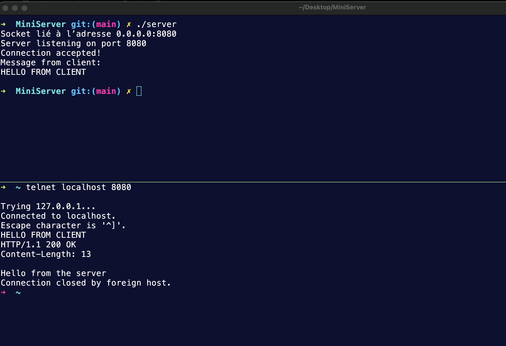

# MiniServer

This project is a simple server implementation in C.

## Getting Started

### Prerequisites
- GCC or any C compiler
- Make

### Build and Run

1. **Clone the repository**
   ```sh
   git clone https://github.com/yassinbenmansour/MiniServer
   cd MiniServer
   ```
2. **Build the server**
   ```sh
   make
   ```
3. **Run the server**
   ```sh
   ./server
   ```

## main.c Overview

The `main.c` file contains the main logic for starting the server. Key steps include:

1. **Socket Creation**: Initializes a socket for communication.
2. **Binding**: Binds the socket to a port and IP address.
3. **Listening**: Listens for incoming client connections.
4. **Accepting Connections**: Accepts and handles client requests.
5. **Response**: Sends responses to clients and manages connections.

Refer to the comments in `main.c` for detailed explanations of each step.

## Example

Below is an example image showing the server in action:



## License

This project is licensed under the MIT License.
